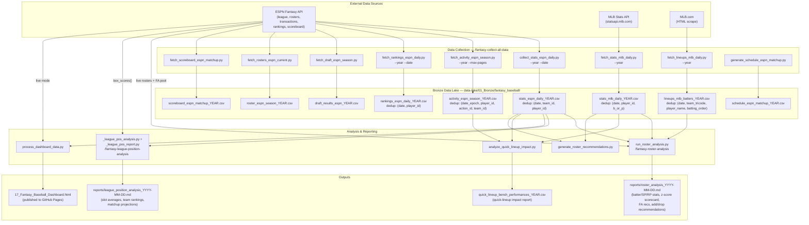

# Fantasy Baseball Data Processing

This project consolidates data collection, analysis tools, and reporting scripts for ensuring domination in the fantasy baseball league (10-team H2H 5x5 categories, ESPN).

## Data Flow

### Scoring System (5x5 H2H Each Category)

| Batting | Pitching |
|---|---|
| Runs (R) | K/9 |
| Home Runs (HR) | Quality Starts (QS) |
| RBI | Saves + Holds (SVHD) |
| Stolen Bases (SB) | ERA |
| OPS | WHIP |

> **Note:** SVHD = SV + HLD — relievers with high hold totals are valuable even without a closer role.

---

## Agent Workflows (`agent/workflows/`)

| Workflow | Command | What it runs |
|---|---|---|
| Collect all data (daily) | `/fantasy-collect-all-data` | Steps 1–5 below in sequence |
| ESPN daily stats | `/fantasy-collect-daily-espn-stats` | `collect_stats_espn_daily.py` |
| ESPN activity | `/fantasy-collect-activity-data` | `fetch_activity_espn_season.py` |
| MLB lineups | `/fantasy-collect-mlb-lineups` | `fetch_lineups_mlb_daily.py` |
| MLB game logs | `/fantasy-collect-daily-mlb-stats` | `fetch_stats_mlb_daily.py` |
| ESPN rankings | `/fantasy-collect-espn-rankings` | `fetch_rankings_espn_daily.py` |
| Roster analysis | `/fantasy-roster-analysis` | `run_roster_analysis.py` |
| League position analysis | `/fantasy-league-position-analysis` | `_league_pos_analysis.py` → `_league_pos_report.py` |

All collection steps are **idempotent** — safe to re-run; duplicates are skipped automatically.

---

## File Overview

### Core Module
- **`mlb_processing.py`**: Central library — ESPN API setup (`load_config`, `setup_league`), data fetching, MLB stats scraping, free agent lookups, and shared utilities used by all other scripts.

### Data Collection (ETL)
- **`collect_stats_espn_daily.py`**: Daily roster stats for all ESPN fantasy teams.
- **`fetch_activity_espn_season.py`**: Season-long transaction log (adds, drops, trades, lineup moves).
- **`fetch_rankings_espn_daily.py`**: Daily player ownership %, trending %, and positional ranks.
- **`fetch_stats_mlb_daily.py`**: Game-log stats for all MLB players from the MLB Stats API (full coverage, no ESPN gaps).
- **`fetch_lineups_mlb_daily.py`**: Daily batting orders scraped from MLB.com; auto-backfills missed dates.
- **`fetch_draft_espn_season.py`**: Draft results for the season.
- **`fetch_rosters_espn_current.py`**: Snapshot of currently active rosters for all teams.
- **`fetch_scoreboard_espn_matchup.py`**: Weekly matchup scores and results.
- **`generate_schedule_espn_matchup.py`**: Generates the league matchup schedule.

### Analysis & Reporting
- **`run_roster_analysis.py`**: Full roster evaluation — batter/SP/RP stats, z-score scorecard (season + 28d), weakest player flags, top FA recommendations (position-matched and position-agnostic), and markdown report.
- **`_league_pos_analysis.py` + `_league_pos_report.py`**: League-wide positional intelligence — slot averages, my team vs league delta, team category rankings, and current matchup projections.
- **`process_dashboard_data.py`**: Generates the interactive Fantasy Baseball Dashboard HTML, published to GitHub Pages. Supports live mode (ESPN API) and dry-run mode (CSV).
- **`analyze_quick_lineup_impact.py`**: Quantifies the stat cost of using ESPN's Quick Lineup auto-set vs manual moves.
- **`generate_roster_recommendations.py`**: Weekly checkpoint analysis — compares 28d z-score of your roster vs available FAs each Monday.
- **`build_roster_history_espn.py`**: Reconstructs daily roster states from draft picks + FA activity.

### Jupyter Notebooks
- **`analyze_roster_churn.ipynb`**: Roster turnover analysis.
- **`batting_order_analysis.ipynb`**: Batting order impact on production.
- **`regression_to_mean.ipynb`**: Performance regression and volatility.
- **`analyze_rookies.ipynb`**: Rookie evaluation.

---

## Future Analysis

Ideas and investigations being tracked in [`ideas.md`](ideas.md). See that file for full context, data sources, and approach notes on each item.

| # | Idea | Description | Status |
|---|------|-------------|--------|
| 1 | Roster Play-Time Density vs Box Score Performance | Measure what % of each team's roster played on a given day and correlate against fantasy scoring. | `Not Started` |
| 2 | Gini Analysis — Box Score Concentration by Player and Team | Apply Gini/Lorenz analysis to fantasy scoring to surface value-concentrated players and keeper candidates. | `Not Started` |
| 3 | Batting Order Position vs Batter Stats | Join batting order position data to game-level stats to measure how lineup slot affects fantasy production. | `Not Started` |
| 4 | Batter Consistency — Streakiness, Slumps, and the OBP Drag Problem | Quantify per-game OBP variance to identify batters whose season averages mask frequent zero-contribution days. | `Not Started` |
| 5 | Box Score Stat Relationships — Correlation, Redundancy, and Scoring System Audit | Build a stat correlation matrix and audit ESPN scoring weights against actual fantasy point drivers. | `Not Started` |
| 6 | Waiver Wire Timing and Transaction ROI | Measure post-acquisition fantasy point ROI for every waiver add and drop to rank teams by transaction quality. | `Not Started` |
| 7 | Ownership Lag — Finding Market Inefficiencies Before ESPN Catches Up | Detect the lag between a player's breakout game logs and ESPN ownership movement to surface buy windows. | `Not Started` |
| 8 | Roster Slot Efficiency — Are Teams Wasting Positional Slots? | Compare each team's per-slot fantasy production against league averages to identify positional dead weight. | `Not Started` |
| 9 | Trade Value Audit — Who Is Winning the League's Trades? | Score every trade by comparing post-trade fantasy output of all players exchanged to determine who won each deal. | `Not Started` |
| 10 | Hot Hand Detection — Rolling Performance Windows for Streaming Decisions | Compute rolling 7/14-day fantasy point windows to flag players running hot or cold relative to their season average. | `Not Started` |
| 11 | Mutually Beneficial Trade Finder — Identifying Win-Win Deals Within the League | Proactively scan all team rosters to find specific player swaps that simultaneously improve both sides of a trade. | `Complete` |
| 12 | Bat Tracking Metrics as Batter Predictors — Year-Over-Year Carry-Forward | Correlate Statcast bat-tracking and pitching metrics year-over-year to find physical leading indicators of fantasy performance. | `Not Started` |
| 13 | Projection Accuracy Tracking — Actual vs Preseason Performance Over Multiple Years | Measure preseason projection accuracy across multiple years to find systematic biases exploitable at draft time. | `Not Started` |
| 14 | Player Injury Data Analysis — Duration, Frequency, and Predictability | Track and analyze player injuries to determine duration, frequency per position, player propensity, and historical trends. | `Complete` |

