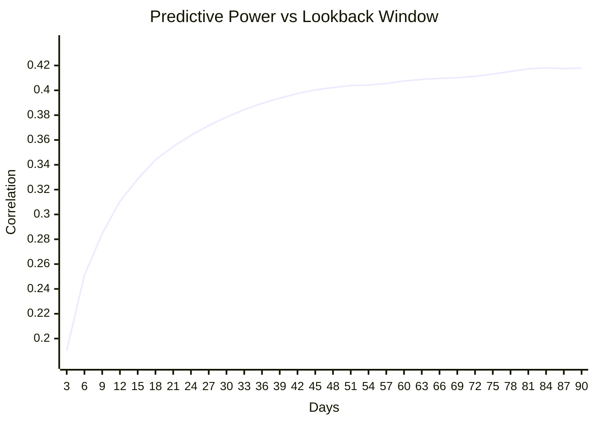
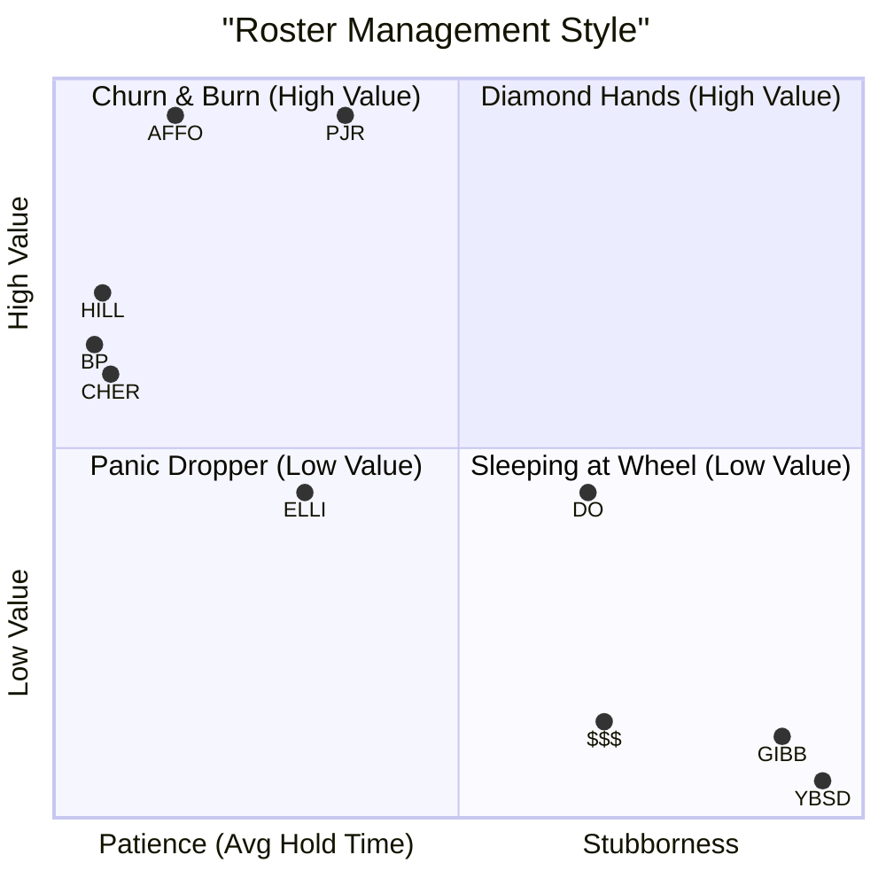

# League-Wide Roster Analysis (Deep Dive)

## 1. Optimal Evaluation Window
**Selected Window:** 30 Days
Correlation with future performance: **0.3784**
*(Analysis performed on all players across the entire league)*

### Sensitivity Analysis (Correlation by Window):
- 3 Days: 0.1904
- 15 Days: 0.3285
- **30 Days**: 0.3784** (Selected)
- 45 Days: 0.4003
- 60 Days: 0.4075
- 75 Days: 0.4131
- 90 Days: 0.4179

## 2. Optimal Roster Cadence
Based on the Top 3 Teams (Average Value: 2438.7):
- **Optimal Churn Rate**: 2.2 adds per week
- **Target Hold Time (Drops)**: 61.3 days

### Member Breakdown (vs Optimal)
| Team | Total Value | Adds/Week | vs Optimal Churn | Avg Hold | Median Hold |
|---|---|---|---|---|---|
| AFFO | 2541.5 | 2.3 | +0.1 | 56.7d | 25.5d |
| PJR | 2540.0 | 1.2 | -1.0 | 82.0d | 69.0d |
| HILL | 2234.7 | 3.1 | +0.9 | 45.4d | 11.5d |
| BP | 2136.9 | 3.3 | +1.0 | 44.6d | 19.0d |
| CHER | 2090.7 | 2.8 | +0.6 | 47.2d | 23.0d |
| DO | 1878.2 | 0.5 | -1.8 | 117.1d | 154.0d |
| ELLI | 1872.6 | 1.4 | -0.8 | 75.6d | 44.0d |
| $$$ | 1478.0 | 0.5 | -1.8 | 120.1d | 155.0d |
| GIBB | 1448.3 | 0.3 | -1.9 | 146.4d | 167.0d |
| YBSD | 1368.1 | 0.1 | -2.1 | 152.2d | 167.0d |

## Visualizations

### Evaluation Window Sensitivity
The curve shows the predictive power of different lookback windows.

### Manager Style: Patience vs. Value

